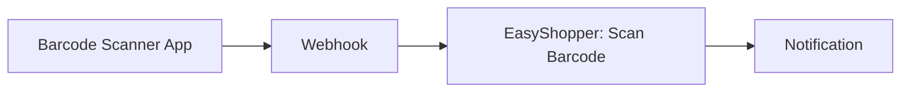

# Barcode-Scan Funktionalität

Die EasyShopper API unterstützt das Hinzufügen von Produkten durch Scannen von Barcodes (GTIN/EAN).

## Funktionsweise

### API-Endpunkt
```
GET /mobile-backend/api/v5/scan/shoppingList/{storeGuid}/{gtin}
```

### Parameter
- **storeGuid**: Store GUID (wird automatisch beim Login abgerufen)
- **gtin**: GTIN/EAN Barcode-Nummer (z.B. `4023300901002`)

## Verwendung in n8n

### 1. Einfacher Barcode-Scan
```
Node: EasyShopper
Resource: Shopping List
Operation: Scan Barcode
Barcode (GTIN/EAN): 4023300901002
```

Das Produkt wird automatisch erkannt und zur Einkaufsliste hinzugefügt.

### 2. Workflow mit externem Scanner



**Beispiel Webhook Payload:**
```json
{
  "barcode": "4023300901002"
}
```

**n8n Workflow:**
```
Webhook Trigger
↓
EasyShopper Node
  Resource: Shopping List
  Operation: Scan Barcode
  Barcode: {{$json.barcode}}
↓
Send Notification
```

### 3. Batch-Scan von mehreren Produkten

```
Set Node (Liste von Barcodes)
  [
    {"barcode": "4023300901002"},
    {"barcode": "4311501451892"},
    {"barcode": "4006040055587"}
  ]
↓
Loop Over Items
↓
EasyShopper: Scan Barcode
  Barcode: {{$json.barcode}}
```

## Response-Daten

Die API liefert umfangreiche Produktinformationen:

### Grundlegende Produktdaten
- **name**: Produktname (z.B. "Obstblütenhonig 250g")
- **brand**: Markenname (z.B. "Langnese Flotte Biene")
- **gtin**: Barcode/GTIN
- **amount**: Menge (Standard: 1)

### Kategorisierung
- **cgLocalKey**: API-Kategorie (z.B. "brotaufstrich")
- **cgIcon**: UI-Icon-Kategorie (z.B. "konfituere_honig")

### Preisinformationen
```json
{
  "priceDetails": {
    "price": 349,      // Preis in Cent (3,49 €)
    "original": 349    // Originalpreis
  }
}
```

### Regalposition
```json
{
  "positions": [
    {
      "shelf": 1204,        // Regal-ID
      "x": 38.71525,        // X-Koordinate im Laden
      "y": -2.9666875,      // Y-Koordinate im Laden
      "systemId": 0
    }
  ]
}
```

### Produkteigenschaften
- **weight**: Gewicht in Gramm (z.B. 284)
- **hasImage**: Produktbild verfügbar (true/false)
- **labels**: Suchbegriffe/Tags (z.B. ["Aufstrich", "Honig"])
- **taxPercent**: MwSt-Satz (z.B. 7.0)

## Beispiele

### Beispiel 1: Langnese Flotte Biene Honig

**Barcode:** `4023300901002`

**Response:**
```json
{
  "success": true,
  "barcodeType": "product",
  "barcode": "4023300901002",
  "product": {
    "shoppingListItemGuid": "0a0dd671-55e0-4a58-b9e6-2cb2526a38c1",
    "brand": "Langnese Flotte Biene",
    "name": "Obstblütenhonig 250g",
    "gtin": "4023300901002",
    "cgLocalKey": "brotaufstrich",
    "cgIcon": "konfituere_honig",
    "priceDetails": {
      "price": 349,
      "original": 349
    },
    "product": {
      "weight": 284,
      "hasImage": true,
      "taxPercent": 7.0,
      "labels": ["Aufstrich", "Brotaufstrich", "Feinkost", "Honig"]
    }
  }
}
```

### Beispiel 2: Integration mit Mobile Scanner App

**Scanner-Apps mit Webhook-Support:**
- [Barcode Scanner](https://play.google.com/store/apps/details?id=com.google.zxing.client.android)
- [QR & Barcode Scanner](https://apps.apple.com/app/qr-code-reader/id1200318119)

**Workflow:**
1. Scanner-App scannt Barcode
2. App sendet Webhook an n8n
3. n8n fügt Produkt zur EasyShopper-Liste hinzu
4. Push-Notification bestätigt Hinzufügen

## Fehlerbehandlung

### Produkt nicht gefunden
Wenn der Barcode nicht in der Datenbank des Ladens vorhanden ist:
```json
{
  "success": false,
  "error": "Product not found",
  "barcode": "1234567890123"
}
```

### Ungültiger Barcode
Bei ungültigem Barcode-Format:
```json
{
  "success": false,
  "error": "Invalid GTIN format"
}
```

### Best Practices
1. **Barcode-Validierung**: Prüfe GTIN-Format (8, 12, 13 oder 14 Stellen)
2. **Error Handling**: Aktiviere "Continue On Fail" in n8n Node
3. **Retry Logic**: Implementiere Retry bei Netzwerkfehlern
4. **Logging**: Protokolliere fehlgeschlagene Scans für spätere Analyse

## GTIN/EAN Format

### Unterstützte Formate
- **EAN-8**: 8-stellig (z.B. 12345678)
- **EAN-13**: 13-stellig (z.B. 4023300901002) - **Standard in Europa**
- **UPC-A**: 12-stellig (z.B. 012345678905) - USA
- **GTIN-14**: 14-stellig (z.B. 10012345678906) - Kartons/Paletten

### Beispiel-Barcodes für Tests

Hier sind einige echte Produkt-Barcodes zum Testen:

| Produkt | Barcode (GTIN) |
|---------|----------------|
| Langnese Honig | 4023300901002 |
| Coca-Cola 1L | 4311501451892 |
| Nutella 400g | 4008400243207 |
| Milka Schokolade | 7622210288684 |

**Hinweis:** Barcodes funktionieren nur für Produkte, die im jeweiligen Laden verfügbar sind.

## Advanced Use Cases

### 1. Inventar-Management
Scanne Produkte beim Verbrauch und füge sie automatisch zur Einkaufsliste hinzu.

### 2. Rezept-basierter Einkauf
- Rezept mit Zutaten und deren Barcodes speichern
- Workflow startet Batch-Scan aller Zutaten
- Komplette Zutatenliste wird zur Einkaufsliste hinzugefügt

### 3. Preis-Tracking
- Scanne regelmäßig dieselben Produkte
- Speichere Preisverlauf in Datenbank
- Sende Alert bei Preisänderungen

## Technische Details

### API Request
```http
GET /mobile-backend/api/v5/scan/shoppingList/682ef075-b1c1-472a-9924-d25748d95ee7/4023300901002
Authorization: Bearer {token}
X-Subscription-Key: {subscription-key}
```

### API Response
```json
{
  "barcodeType": "product",
  "data": {
    "shoppingListItemGuid": "...",
    "itemId": "...",
    "gtin": "4023300901002",
    "brand": "...",
    "name": "...",
    "product": { ... },
    "priceDetails": { ... }
  },
  "properties": {
    "productLookupGtin": "4023300901002"
  }
}
```

## Quelle

Diese Dokumentation basiert auf der Analyse der EasyShopper API (Whiz-Cart v4.143.0-144352) mittels mitmproxy Flow-Capture vom 15.11.2025.
